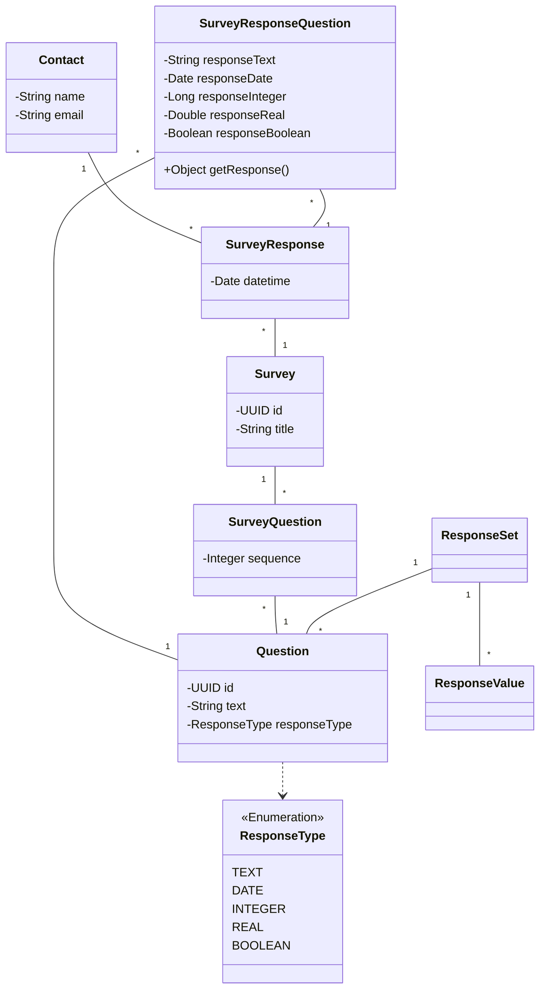

# Survey Project

This project creates and manages dynamics surveys and link them with a pool of questions also created dynamically and it also has hability to capture responses. 

Each survey is bound to a contact.

This model is based from https://www.youtube.com/watch?v=SjRuAC5rLsk
##  The Model

## Autores

- [@rodmibielli](https://www.github.com/rodmibielli)

## Stack utilizada

**Front-end:** RESTful web services, Swagger UI

**Back-end:** Java 17+, Maven 3, Spring Boot 3, JPA with Hibernate, H2 for dev db, MySQL for prod db.

## References

 - [Data Architecture: Survey Data Model Explained, Simple to Complex](https://www.youtube.com/watch?v=SjRuAC5rLsk)

