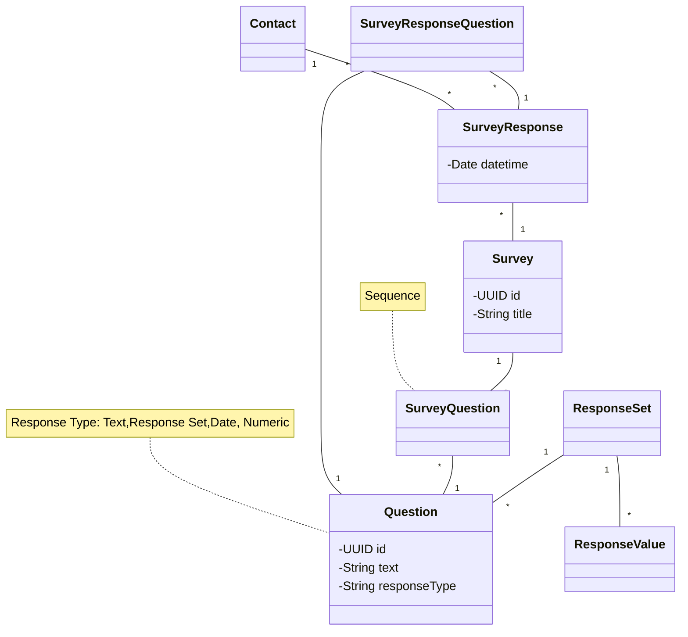

# survey

```mermaid
classDiagram
 
 class Contact {
   
 }
 
 class Survey {
    -UUID id
    -String title
 }

 note for Question "Response Type: Text,Response Set,Date, Numeric"
 class Question {
    -UUID id
    -String text
    -String responseType
 }

 note for SurveyQuestion "Sequence"
 class SurveyQuestion {
    
 }
 

 class SurveyResponse {
   -Date datetime
   
 }

 class ResponseSet {

 }

 class ResponseValue {
    
 }

 class SurveyResponseQuestion {
 }
 
 Contact "1"--"*" SurveyResponse
 SurveyResponseQuestion "*"--"1" SurveyResponse
 SurveyResponseQuestion "*" -- "1" Question
 
 Survey "1"--"*" SurveyQuestion
 SurveyQuestion "*"--"1" Question
 SurveyResponse "*"--"1" Survey
 ResponseSet "1"--"*" ResponseValue

 ResponseSet "1"--"*" Question
 
```
