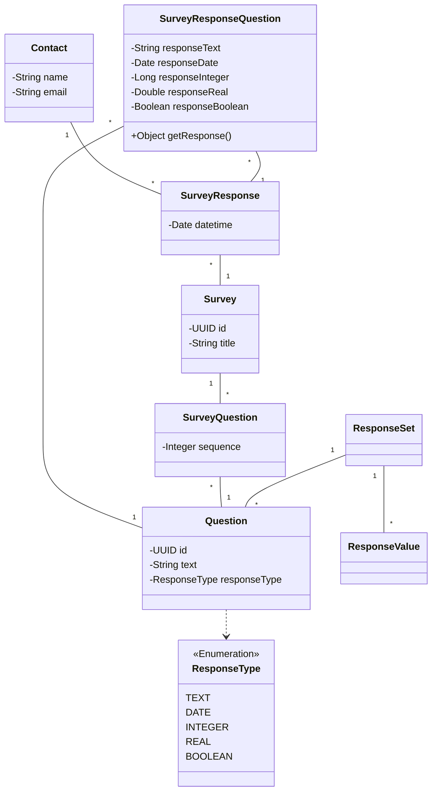

# survey

```mermaid

classDiagram
 
 class Contact {
   -String name
   -String email
 }
 
 class Survey {
    -UUID id
    -String title
 }

 class Question {
    -UUID id
    -String text
    -ResponseType responseType
 }

 class ResponseType {
    <<Enumeration>>
    TEXT
    DATE
    INTEGER
    REAL 
    BOOLEAN 
 }
 
 class SurveyQuestion {
   -Integer sequence 
 }
 

 class SurveyResponse {
   -Date datetime
   
 }

 class ResponseSet {

 }

 class ResponseValue {
    
 }

 class SurveyResponseQuestion {
    -String responseText
    -Date responseDate
    -Long responseInteger
    -Double responseReal
    -Boolean responseBoolean
    +Object getResponse()
 }
 
 Contact "1"--"*" SurveyResponse
 SurveyResponseQuestion "*"--"1" SurveyResponse
 SurveyResponseQuestion "*" -- "1" Question
 
 Survey "1"--"*" SurveyQuestion
 SurveyQuestion "*"--"1" Question
 SurveyResponse "*"--"1" Survey
 ResponseSet "1"--"*" ResponseValue

 ResponseSet "1"--"*" Question
 Question..>ResponseType
  
```
